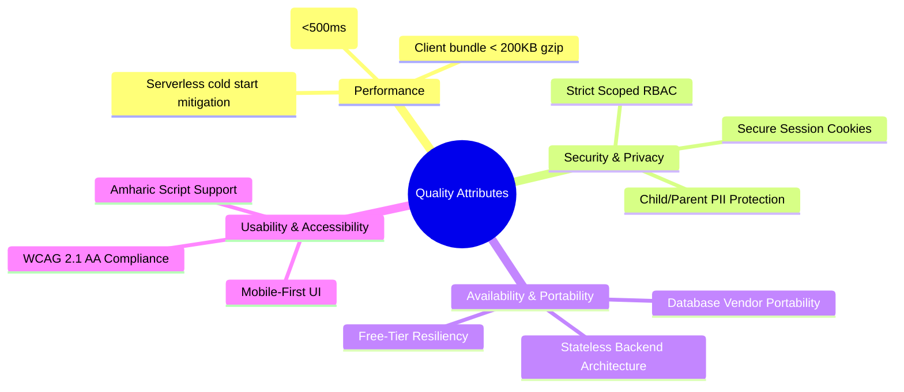

# Non-Functional Requirements Document (NFR)

## Hitsanat Kifl Children's Ministry Management System
**Document Version:** 2.1  
**Target Infrastructure:** Free-Tier Cloud Ecosystem (Render, Vercel, Supabase)  

---

## 1. Overview & Quality Attributes

This document establishes the architectural, operational, performance, security, and accessibility constraints for the Hitsanat Kifl digital system.

---

## 2. Granular Non-Functional Requirements

### 2.1 Performance & Latency
- **NFR-01.1 (API Latency):** Under standard load, 95% of API requests (`p95`) must resolve in $< 400\text{ ms}$, excluding network transit.
- **NFR-01.2 (Cold Start Tolerance):** On the Render free-tier instance, cold-start response time must not exceed $45\text{ seconds}$, with health-check ping mechanisms in place to keep the service warm during critical operating windows (e.g., Saturday & Sunday mornings).
- **NFR-01.3 (Frontend Bundle Size):** Next.js initial JavaScript bundle for mobile clients must remain $< 180\text{ KB}$ gzipped.
- **NFR-01.4 (Database Query Performance):** All transactional queries must complete in $< 50\text{ ms}$. Complex aggregation queries for periodic reports must complete in $< 300\text{ ms}$.

### 2.2 Security & Data Privacy
- **NFR-02.1 (Child Data Protection):** Contact details and home addresses of children and parents must never be exposed via public endpoints. Only authenticated leaders with relevant scope can query child profiles.
- **NFR-02.2 (Authentication & Session Management):** User authentication is powered by Better Auth using httpOnly, secure, SameSite cookies with cryptographically signed tokens.
- **NFR-02.3 (Authorization Enforcement):** Role-Based Access Control (RBAC) must be validated at the API controller layer prior to executing domain logic. Client-side hiding of UI elements is considered cosmetic and not a security boundary.
- **NFR-02.4 (Injection & CSRF Defense):** All incoming HTTP payloads must be validated against strict Zod schemas. SQL injection is prevented through parameterized queries via Drizzle ORM. CORS policies restrict mutations to authorized origins.

### 2.3 Reliability, Availability & Portability
- **NFR-03.1 (Stateless Backend):** `apps/api` must be completely stateless. No session state, files, or persistent caching may rely on the local disk filesystem.
- **NFR-03.2 (Database Portability):** While Supabase PostgreSQL is the initial managed host, database schemas, constraints, and queries must adhere to standard ANSI SQL/PostgreSQL 15+ without proprietary vendor locks, ensuring portability to AWS RDS, self-hosted Postgres, or Neon.
- **NFR-03.3 (Data Integrity & Transactions):** All cross-entity mutations (e.g., creating an event with assignments and auto-seeding attendance records) must execute within atomic database transactions (`tx`).

### 2.4 Usability & Localization (Ethiopian Context)
- **NFR-04.1 (Mobile-First Responsiveness):** Since ministry leaders frequently manage attendance and schedules using mobile smartphones on-site at church or during transport routes, the Admin UI (`apps/admin`) must provide fully responsive layouts for viewport widths down to $360\text{ px}$.
- **NFR-04.2 (Ethiopian Calendar Fidelity):** The UI must render dates using the Ethiopian Calendar formatting (`DD/MM/YYYY E.C.` or Amharic month names like `ጥቅምት 15, 2016`) across all forms, filters, and tables.
- **NFR-04.3 (Amharic Font Rendering):** Unicode Ethiopic script (Ge'ez characters `U+1200` to `U+137F`) must render smoothly without glyph truncation or layout jitter on standard mobile browsers (Android Chrome, iOS Safari).

### 2.5 Accessibility (a11y)
- **NFR-05.1 (Standard Compliance):** The web applications must conform to WCAG 2.1 Level AA.
- **NFR-05.2 (Keyboard & Screen Reader Support):** All shadcn/ui dialogs, dropdowns, forms, and tables must be navigable via standard keyboard controls with explicit ARIA attributes and focus traps.
