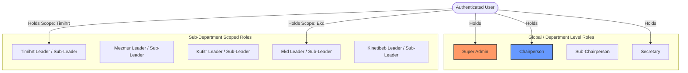

# Roles & Permissions Specification (RBAC)

## Hitsanat Kifl Children's Ministry Management System
**Document Version:** 2.1  
**Architecture Pattern:** Scoped Role-Based Access Control (ADR-0005)  

---

## 1. Authorization Philosophy & Scoped Model

Rather than assigning a single, global enum role to a user, the system evaluates permissions based on a combination of **Department-Level Roles** and **Sub-Department Scoped Roles**.

### Core Security Invariants:
1. **Regular Members Have No Admin Access (ADR-0007):** Regular student members (`MEMBER_REGULAR`) without an active leadership post cannot authenticate into `apps/admin`.
2. **Scope Isolation:** A Timihrt leader cannot modify Mezmur songbooks or change Saturday transportation routes.
3. **Executive Oversight:** The Chairperson, Sub-Chairperson, and Super Admin hold cross-departmental visibility and approval authority.

---

## 2. Role Taxonomy & Responsibility Scopes

| Role Identifier | Role Level | Assigned Scope | Key System Responsibilities |
| :--- | :--- | :--- | :--- |
| `SUPER_ADMIN` | System | Global (`*`) | Full system administration, database maintenance, leader user account creation & permission management. |
| `CHAIRPERSON` | Ministry Executive | Global (`*`) | Full operational visibility, leader user account creation/role updates, plan approvals, final report sign-offs, meeting scheduling & minutes tracking. |
| `SUB_CHAIRPERSON` | Ministry Executive | Global (`*`) | Assists Chairperson; delegated cross-departmental oversight, meeting scheduling & minutes tracking. Holds standing deputy authority over executive approvals (ADR-0018). |
| `SECRETARY` | Ministry Executive | Administrative Core | Member registration, child/parent registration, family allocation, meeting scheduling & minutes tracking, bulk import/export, member transfers, batch operations, data quality management. |
| `SUB_DEPT_LEADER` | Sub-Department | `Timihrt` | Curriculum, teacher assignments, academic score management, report card generation. |
| `SUB_DEPT_LEADER` | Sub-Department | `Mezmur` | Hymn repertoire, conductor assignments, Awdemerit preparation. |
| `SUB_DEPT_LEADER` | Sub-Department | `Kutitr` | Attendance confirmation, 5 transport collection points, headcount. |
| `SUB_DEPT_LEADER` | Sub-Department | `Ekd` | Master annual plan, event creation, progress aggregation, reports. |
| `SUB_DEPT_LEADER` | Sub-Department | `Kinetibeb` | Religious film library, puppet theater, Yeteret Abat schedules. |
| `SUB_DEPT_SECRETARY` | Sub-Department | Department Scope | Records notes, assists leader in score/attendance/progress entry. |
| `MEMBER_REGULAR` | Member | None | **No admin portal access**. Interacts via Public Website & Telegram. |

---

## 3. Comprehensive Permissions Matrix

The matrix below defines permissions across all API resources: `C` (Create), `R` (Read), `U` (Update), `D` (Delete), `A` (Approve).

| Module / Resource | Super Admin | Chairperson | Secretary | Timihrt Lead | Mezmur Lead | Kutitr Lead | Ekd Lead | Kinetibeb Lead | Regular Member |
| :--- | :---: | :---: | :---: | :---: | :---: | :---: | :---: | :---: | :---: |
| **Member Profiles (Stage 1 & 2)** | CRUD | CRUD | CRUD | R (Self/Team) | R (Self/Team) | R (All) | R (All) | R (Self/Team) | None |
| **Family Setup & Assignment** | CRUD | CRUD | CRUD | R | R | R | R | R | None |
| **Children Profiles & Groups** | CRUD | CRUD | CRUD | R | R | CRUD | R | R | None |
| **Parent Records & Links** | CRUD | CRUD | CRUD | R | R | CRUD | R | R | None |
| **Saturday Route Allocation** | CRUD | CRUD | R | None | None | CRUD | R | None | None |
| **Weekly Program Attendance** | CRUD | CRUD | R | R | R | CRUD | R | R | None |
| **Curriculum & Teacher Roster**| CRUD | CRUD | R | CRUD | None | None | R | None | None |
| **Academic Scores & Exams** | CRUD | CRUD | R | CRUD | None | None | R | None | None |
| **Hymn Playlist & Astegni** | CRUD | CRUD | R | None | CRUD | None | R | None | None |
| **Film & Yeteret Abat Roster**| CRUD | CRUD | R | None | None | None | R | CRUD | None |
| **Annual Master Plan** | CRUD | CRUDA | R | R (Own Plan) | R (Own Plan) | R (Own Plan) | CRUD | R (Own Plan) | None |
| **Plan Distribution** | CRUD | CRUDA | None | None | None | None | CRUD | None | None |
| **Weekly Execution & Progress**| CRUD | CRUD | None | CRU (Own) | CRU (Own) | CRU (Own) | CRU (All) | CRU (Own) | None |
| **Events & Special Programs** | CRUD | CRUDA | R | R (Assigned) | R (Assigned) | R (Assigned) | CRUD | R (Assigned) | None |
| **Periodic Reports (W/M/Q/A)**| CRUD | CRUDA | R | CR (Own) | CR (Own) | CR (Own) | CRUDA (All)| CR (Own) | None |
| **Public Announcements** | CRUD | CRUDA | CRU | None | None | None | CRUD | None | None |
| **Telegram Broadcast Triggers**| CRUD | CRUD | CRU | None | None | None | CRUD | None | None |
| **Leadership Meetings** | CRUD | CRUD | CRUD | R (Assigned) | R (Assigned) | R (Assigned) | R (Assigned) | R (Assigned) | None |
| **Bulk Import/Export** | CRUD | CRUD | CRUD | None | None | None | None | None | None |
| **Member Transfers** | CRUD | CRUD | CRUD | None | None | None | None | None | None |
| **Registration Analytics** | R | R | R | None | None | None | None | None | None |
| **Batch Operations** | CRUD | CRUD | CRUD | None | None | None | None | None | None |
| **Data Quality** | CRUD | CRUD | CRUD | None | None | None | None | None | None |
| **Parent Directory** | R | R | R | R (Dept) | R (Dept) | R (Dept) | R (Dept) | R (Dept) | None |
| **Family Tree** | R | R | R | R (Dept) | R (Dept) | R (Dept) | R (Dept) | R (Dept) | None |
| **Secretary Audit Trail** | R | R | R | None | None | None | None | None | None |
| **Report Cards** | CRUD | R | R | CRUD | None | None | None | None | None |
| **Route Performance** | CRUD | CRUD | R | R (Own) | None | None | None | None | None |
| **Parent Contact Quick View** | R | R | R | R (Own) | None | None | None | None | None |
| **Emergency Contact Database** | R | R | R | R (Own) | None | None | None | None | None |
| **Plan Approval Workflow** | CRUD | CRUD | R (View) | R (Submit) | None | None | CRUD | None | None |
| **Progress Heatmap** | CRUD | CRUD | R | CRUD | None | None | CRUD | None | None |

---

## 4. API Authorization Guard Implementation

Permission evaluation at the Express controller level uses two composable middlewares:
1. `requireAuth()`: Verifies a valid Supabase JWT session (cookie or `Authorization: Bearer` header).
2. `requireScopePermission(resource, action, subDeptScope?)`:
   - Checks if the user holds a Global Executive Role (`SUPER_ADMIN`, `CHAIRPERSON`, `SUB_CHAIRPERSON`).
   - If not global, checks if the user holds an active leadership role for the targeted sub-department (`subDeptScope`).
   - If authorization fails, returns `HTTP 403 Forbidden` with error code `FORBIDDEN_INSUFFICIENT_SCOPE`.

### 4.1 One Leadership Post Rule (BR-009)

A member holds **at most one leadership post** across the whole organization:

- Executive roles (`SUPER_ADMIN`, `CHAIRPERSON`, `SUB_CHAIRPERSON`, `SECRETARY`) are mutually exclusive with each other.
- An executive role excludes sub-department `Leader`/`Sub-Leader` posts, and vice versa.
- A member may be `Leader` or `Sub-Leader` of **at most one** sub-department.
- Plain sub-department `Member` and sub-department `Secretary` roles may be held in any number of departments regardless of leadership status.

Enforced in the users module use-cases and by a database trigger (`0004_one_leadership_post.sql`).

### 4.2 BR-008: User Management Restriction

User account management (create, update, reset password, deactivate) is restricted to `SUPER_ADMIN` and `CHAIRPERSON` global roles. This is enforced in:
- `apps/api/src/modules/users/presentation/users.router.ts`
- `apps/api/src/modules/audit/presentation/audit.router.ts`

### 4.3 Super Admin Bypass

The `SUPER_ADMIN` role bypasses all permission checks. This is a design decision: Super Admin has unrestricted access to all resources and actions.

### 4.4 Super Admin UI Pages

| Page | Route | Description |
| :--- | :--- | :--- |
| Super Admin Dashboard | `/super-admin` | System overview KPIs, user accounts, system health, activity feed |
| User Management | `/users` | CRUD for user accounts, password reset, deactivation |
| Audit Logs | `/audit-logs` | Chronological audit trail of administrative actions |
| Permission Matrix | `/permissions` | Static reference view of role-based access control |

### 4.5 Planned Enhancements (v2.2 — ✅ Implemented)

Agreed in the September 2026 Super Admin review session; all items are now implemented and tested. Full descriptions: system documentation § 7.10.6; requirement text: functional-requirements.md FR-13.6 – FR-13.13.

- ✅ **Account reactivation** — restore deactivated accounts (`POST /users/:id/reactivate`, `USER_REACTIVATED`)
- ✅ **Edit user / role reassignment** — edit dialog on `PATCH /users/:id` reassigning leadership roles per BR-008, with BR-007/BR-009 revalidation
- ✅ **Searchable member picker** — replaces raw member UUID entry for BR-007 member links
- ✅ **Leadership handover workflow** — guided annual role-transfer sequence (successor-first, three steps: create → demote → deactivate; FR-13.9)
- ✅ **Audit log filters & CSV export** — action, date, and actor filtering with export
- ✅ **Account self-protection** — no self-deactivation, no last-admin lockout
- ✅ **Break-glass logging** — `BYPASS_ACTION` audit entries for all actions performed under the § 4.3 permission bypass
- ✅ **Session revocation** — force sign-out of live sessions (`POST /users/:id/revoke-sessions`, `SESSIONS_REVOKED`)
- ✅ **Account stats + seed status** — `GET /users/stats` powers the System Snapshot; `GET /system-metadata` surfaces seed/migration status (FR-13.4)

**Remaining:** none for this review batch. OD-05 permission-overrides is RESOLVED as Option A (static matrix + SUPER_ADMIN bypass; see `open-decisions.md`).

### 4.6 Sub-Chairperson Deputy Authority (ADR-0018)

The `SUB_CHAIRPERSON` holds **standing deputy authority** over the Chairperson's executive approval actions — no per-item delegation is required:

- Review of plan change requests (`PATCH /api/v1/ekd/approvals/:id/review`)
- Periodic report sign-off & archive (`PATCH /api/v1/reports/:id/approve`)
- Event approval & publish flag (`PATCH /api/v1/events/:id/approve`)

**Explicitly excluded from deputy authority:** user account management (BR-008 remains `SUPER_ADMIN` + `CHAIRPERSON` only) and any ability to re-delegate. All deputy actions are audit-logged under the acting user's own identity, and both executive roles receive the same approval notifications.

> Note: The Vice-Chairperson dashboard's read-only *oversight* view (dashboards.md §1.2) is distinct from these approval *actions*; the Sub-Chairperson can view everything read-only and additionally execute the three approval actions above.
