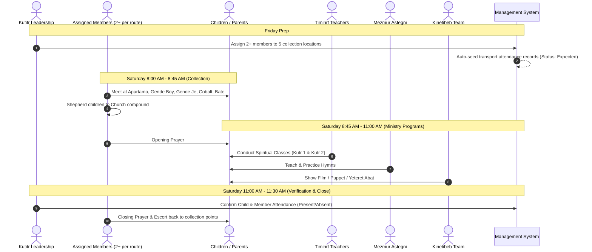
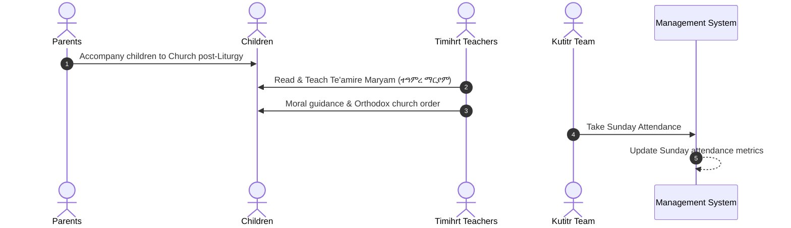
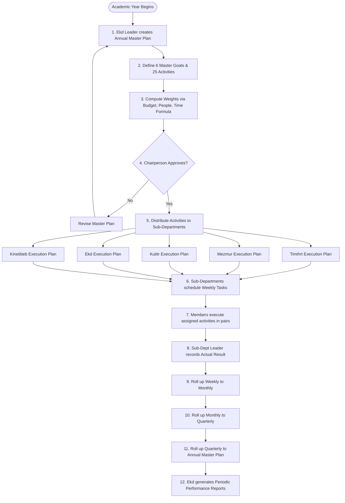
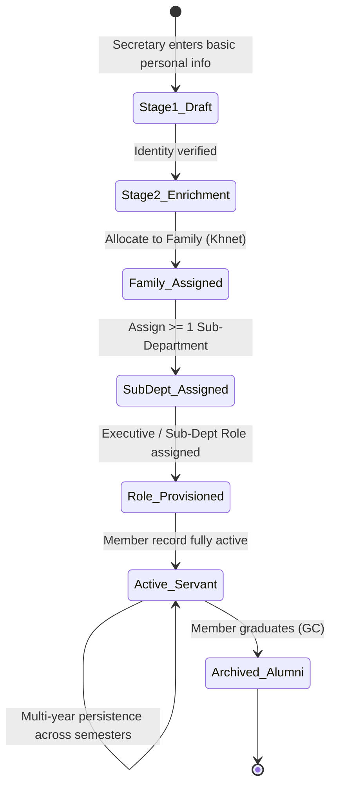
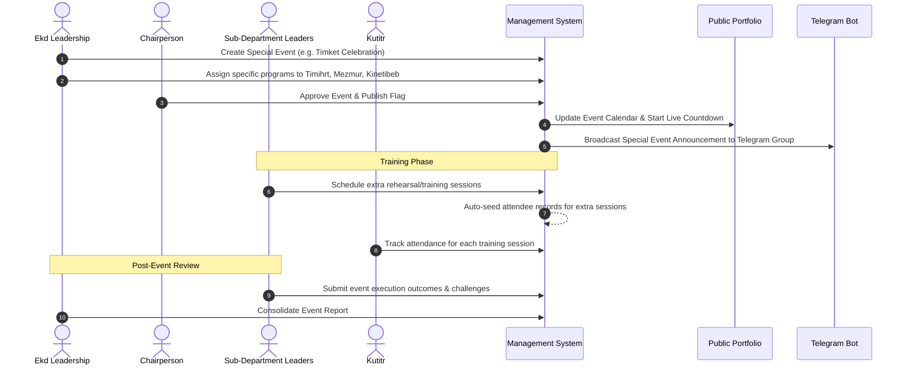

# System Operational Workflows

## Hitsanat Kifl Children's Ministry Management System
**Document Version:** 2.1  
**Status:** Canonical Workflow Standard  

---

## 1. Primary Operational Workflows

This document models the core recurring and event-driven workflows executed by the leadership and servants of Hitsanat Kifl.

---

## 2. Saturday Ministry Workflow (8:00 AM – 11:30 AM)

---

## 3. Sunday Ministry Workflow (8:00 AM – 10:00 AM)

---

## 4. Hierarchical Planning & Roll-Up Workflow

---

## 5. Member Registration & Onboarding Lifecycle

---

## 6. Special Event & Training Workflow (e.g. Timket, Hosaena)

