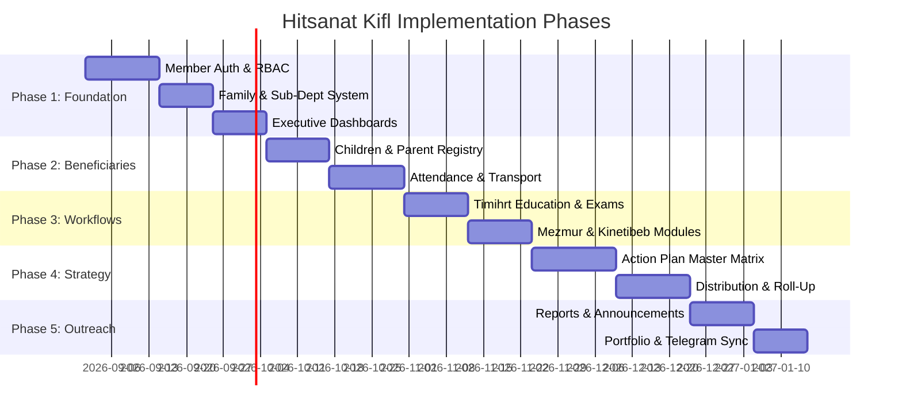

# Implementation Roadmap & Release Phases

## Hitsanat Kifl Children's Ministry Management System
**Document Version:** 2.1  
**Phased Engineering Strategy**  

---

## 1. Release Timeline Overview

---

## 2. Phase Breakdown & Acceptance Criteria

### Phase 1: Ministry Foundation & Governance
- **Modules:** `members`, `families`, `sub-departments`, `packages/auth`, `packages/permissions`.
- **Database:** Member profiles, sub-dept scoped memberships, family Father/Mother assignments.
- **API:** Authentication (`/api/v1/auth/*`), member 2-stage creation, family CRUD.
- **Frontend:** Login page, Chairperson overview, Secretary member registration wizard.
- **Acceptance Criteria:** Leaders can authenticate; regular members are denied access; Secretary can register student servants and assign them to families and sub-departments.

### Phase 2: Children, Parents & Attendance Logistics
- **Modules:** `children`, `parents`, `attendance`, `packages/calendar`.
- **Database:** Child profiles, Parent contacts, composite unique parent cardinality, session attendance rosters.
- **API:** Child registration, parent linking, auto-seeded attendance verification, Saturday transport assignment.
- **Frontend:** Kutitr attendance checksheets, child directory, 5-route transport dispatcher.
- **Acceptance Criteria:** Strict parent cardinality enforced; attendance records auto-seed upon session scheduling; Kutitr can confirm attendance on mobile.

### Phase 3: Sub-Department Educational & Cultural Workflows
- **Modules:** `academic-tracking`, `mezmur`, `kinetibeb`.
- **Database:** Timihrt curriculum, exam scores, Mezmur songbook, Kinetibeb films & storytelling roster.
- **API:** Syllabus endpoints, gradebook scoring, choir rehearsal schedules.
- **Frontend:** Timihrt teacher roster and gradebook, Mezmur hymn viewer, Kinetibeb schedule manager.
- **Acceptance Criteria:** Timihrt teachers enter scores; Mezmur leaders schedule Astegni choir conductors.

### Phase 4: Strategic Action Plan & Hierarchical Execution
- **Modules:** `planning`, `events`.
- **Database:** Annual master plan (2016 E.C.), 6 goals, 25 activities, weight metrics, weekly plans, progress records.
- **API:** Master plan creation, 3-factor weight engine, plan distribution to sub-departments, weekly task logging, bottom-up progress roll-up.
- **Frontend:** Interactive Master Plan spreadsheet matrix, sub-department plan execution view, progress KPI charts.
- **Acceptance Criteria:** Weight calculation matches Action PLN formula ($\sum = 100.0\%$); weekly task completion rolls up to annual progress.

### Phase 5: Reporting, Outreach & Integrations
- **Modules:** `reports`, `announcements`, `apps/portfolio`, `apps/telegram`.
- **API:** Periodic report consolidation, public stats feed, announcement webhooks.
- **Frontend / Worker:** Public portfolio website with live feast countdowns, Telegram broadcast worker.
- **Acceptance Criteria:** Ekd generates consolidated quarterly reports; announcements publish to public website and Telegram group simultaneously.
