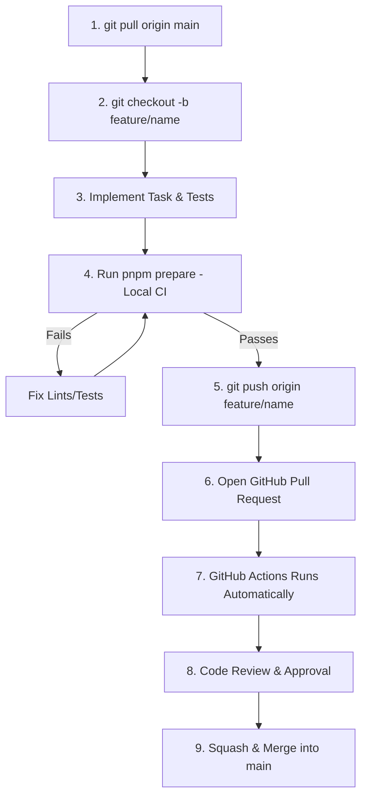

# Team Git Workflow & Branching Standards

## Hitsanat Kifl Children's Ministry Management System
**Document Version:** 2.1  

---

## 1. Feature Branch Lifecycle

Every contributor works in an isolated feature branch. Pushing directly to `main` is strictly forbidden.



---

## 2. Branch Naming Conventions

All branches must adhere to standard prefixes:

| Branch Type | Format Pattern | Example |
| :--- | :--- | :--- |
| **Feature** | `feature/<short-description>` | `feature/annual-plan-matrix`, `feature/child-registration` |
| **Bugfix** | `fix/<short-description>` | `fix/parent-cardinality-check`, `fix/attendance-seed-bug` |
| **Refactoring** | `refactor/<short-description>`| `refactor/clean-architecture-timihrt` |
| **Testing** | `test/<short-description>` | `test/planning-weight-spec`, `test/e2e-member-flow` |
| **Documentation** | `docs/<short-description>` | `docs/api-specification-v2` |
| **Chore / Config** | `chore/<short-description>` | `chore/upgrade-biome`, `chore/docker-compose-pg` |

---

## 3. Commit Message Standards (Conventional Commits)

```text
<type>(<scope>): <short summary in present tense>

[optional detailed body]

[optional issue reference]
```

### Examples:
- `feat(planning): implement 3-factor weight calculation engine`
- `fix(attendance): prevent duplicate seeding for extra training sessions`
- `test(children): add composite unique index test for parent cardinality`
- `docs(database): document ERD and foreign key constraints`
