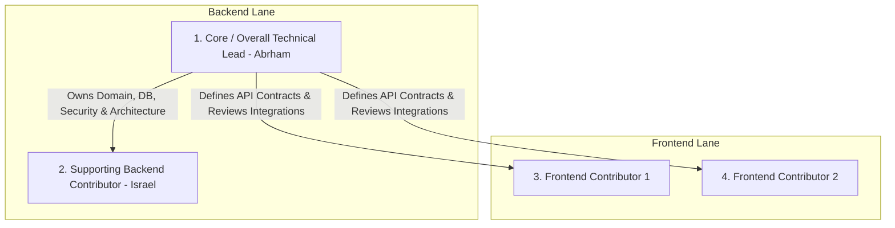

# Team Structure & Role Ownership Model

## Hitsanat Kifl Children's Ministry Management System
**Document Version:** 2.1  
**Team Model:** 4-Person Multi-Lane Ownership Architecture (ADR-0016)  

---

## 1. Four-Contributor Lane Structure

---

## 2. Lane Responsibilities & Boundaries

### 2.1 Core / Overall Technical Lead (Abrham)
- **Authority:** Final technical decision-maker across the entire monorepo.
- **Direct Ownership:**
  - System and module architecture, Clean Architecture enforcement.
  - PostgreSQL schema design, migrations, and Drizzle configurations.
  - Better Auth authentication, session handling, and scoped RBAC.
  - Core domain models, calculation engines (Weight formulas, Progress roll-ups).
  - Shared infrastructure packages (`packages/domain`, `packages/database`, `packages/permissions`, `packages/calendar`).
  - Code reviews for all backend PRs and cross-lane contracts.
  - CI/CD standards and production deployment configurations.

### 2.2 Supporting Backend Contributor (Israel)
- **Role:** Works on well-defined, beginner-safe backend tasks within the established architecture.
- **Allowed Tasks:**
  - Standard CRUD endpoints and use cases (e.g. Children registration, Parent linking, simple reports).
  - Zod validation schema implementation in `packages/validation`.
  - Focused unit and integration tests for assigned endpoints.
  - Seed script maintenance and documentation updates.
- **Strict Boundary:** Israel must **not** independently alter database migrations, auth logic, RBAC tables, transaction infrastructure, or shared package contracts without Core Lead approval. Israel may not self-merge PRs.

### 2.3 Frontend Lane (2 Contributors)
- **Role:** Responsible for user interface implementation across `apps/admin` and `apps/portfolio`.
- **Direct Ownership:**
  - Next.js 15 pages, layouts, and Server/Client Components.
  - shadcn/ui components (`packages/ui`) adhering to preset `b1D0f7S7`.
  - TanStack Query data fetching, caching, and optimistic mutations.
  - Mobile-first responsive layouts, dialogs, drawers, and tables.
  - Client-side form validation using React Hook Form + Zod.
  - Component tests and Playwright E2E tests.
- **Boundary:** Frontend contributors consume API contracts and do not unilaterally alter backend behavior.
