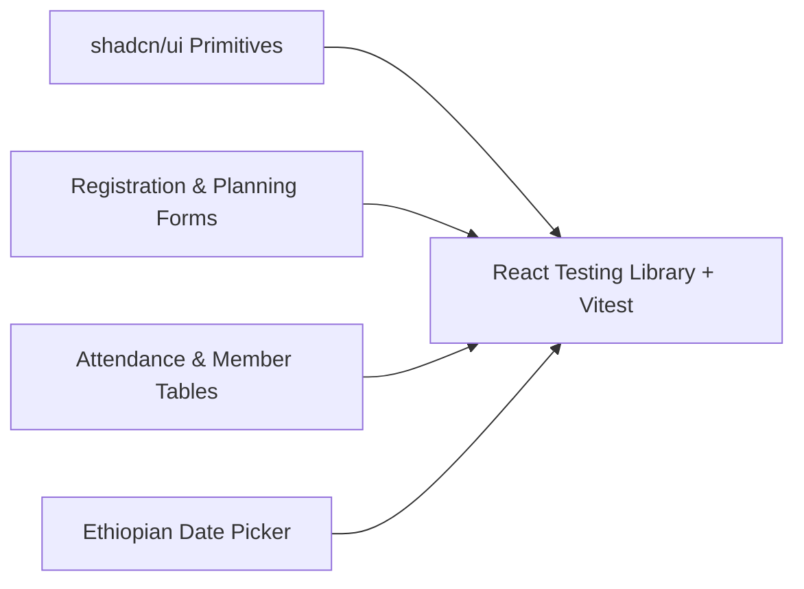

# Testing: Component & UI Tests

## Hitsanat Kifl Children's Ministry Management System
**Document Version:** 2.1  
**Runner:** Vitest + React Testing Library (`pnpm test:component`)  

---

## 1. Component Testing Scope

Component tests verify that frontend React components in `packages/ui` and `apps/admin` render cleanly, validate user input, and handle dynamic states (loading, error, empty).

---

## 2. Key Component Test Cases

1. **`EthiopianDatePicker.spec.tsx`:** Verifies calendar grid rendering in Ge'ez script, year navigation in E.C., and selection change events.
2. **`MemberStage1Form.spec.tsx`:** Validates client-side Zod form errors when required fields are missing or phone numbers are malformed.
3. **`AttendanceVerificationTable.spec.tsx`:** Verifies quick-confirm status toggles (`Present`, `Absent`, `Excused`) and optimistic UI updates.
4. **`PlanningMatrixTable.spec.tsx`:** Verifies horizontal scrolling on small viewport sizes and interactive weight metric tooltips.
