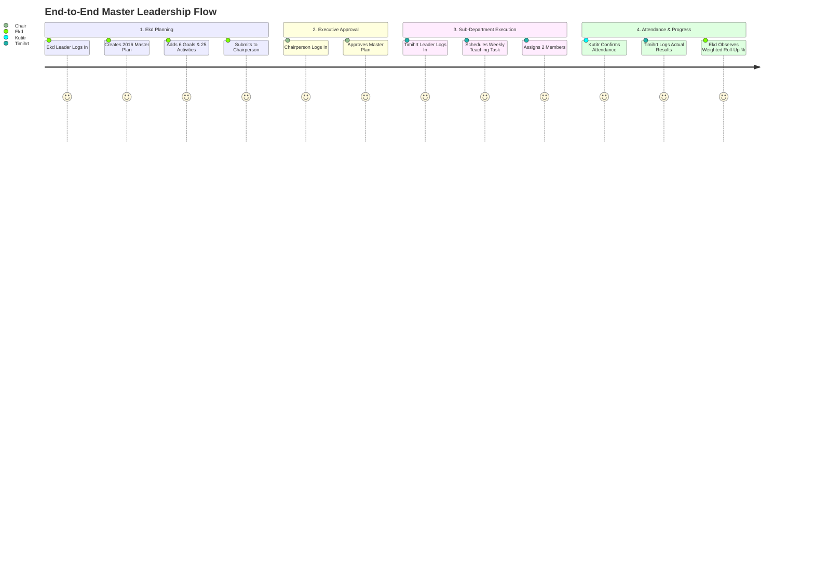

# Testing: End-to-End (E2E) & User Journeys

## Hitsanat Kifl Children's Ministry Management System
**Document Version:** 2.1  
**Runner:** Playwright (`pnpm test:e2e`)  

---

## 1. End-to-End Testing Strategy

Playwright tests simulate complete, multi-role user journeys across browser viewports (Desktop Chromium, Mobile Safari/Chrome).

---

## 2. Core E2E Test Scenarios

1. **`01-auth-and-role-routing.e2e.ts`:** Verifies that logging in as Chairperson routes to `/chairperson`, while Timihrt leader routes to `/timihrt`. Verifies regular member login is rejected.
2. **`02-member-lifecycle.e2e.ts`:** Secretary creates member (Stage 1), enriches profile (Stage 2), assigns to Family, and provisions leadership role.
3. **`03-child-parent-cardinality.e2e.ts`:** Registers child, links Father and Mother, and verifies UI blocks adding a duplicate second Father.
4. **`04-planning-distribution-rollup.e2e.ts`:** Ekd creates plan $\rightarrow$ Chairperson approves $\rightarrow$ Ekd distributes $\rightarrow$ Sub-dept schedules weekly task $\rightarrow$ Logs output $\rightarrow$ Verifies roll-up score in executive dashboard.
