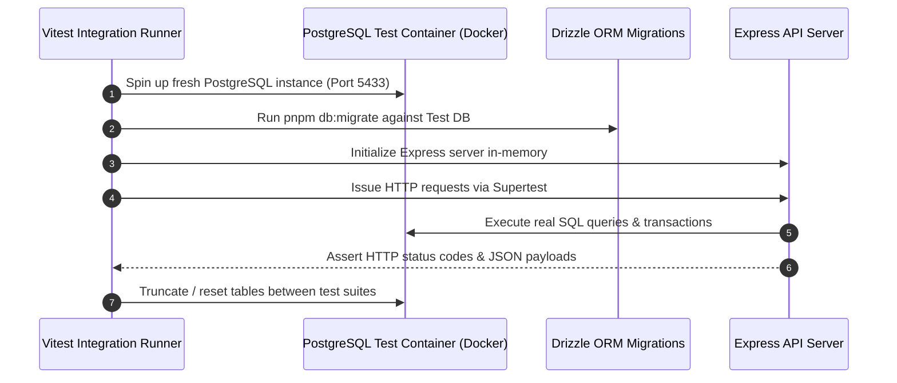

# Testing: Integration & Database Tests

## Hitsanat Kifl Children's Ministry Management System
**Document Version:** 2.1  
**Runner:** Vitest + Supertest + Disposable PostgreSQL Docker DB  

---

## 1. Integration Test Architecture

---

## 2. Mandatory Integration Test Suites

1. **Member & Role Assignment Suite:** Tests Stage 1 fast create, Stage 2 sub-dept assignment, and role upgrades.
2. **Parent Cardinality Constraint Suite:** Verifies that attempting to link a second Father or second Mother to a child throws a database constraint violation and returns `HTTP 409 Conflict`.
3. **Attendance Auto-Seeding Suite:** Verifies that creating an event or transport assignment atomically populates the `Expected` attendance table.
4. **Planning Distribution & Execution Suite:** Verifies distribution of master activities to sub-departments, creation of weekly tasks, and atomic progress updates.
