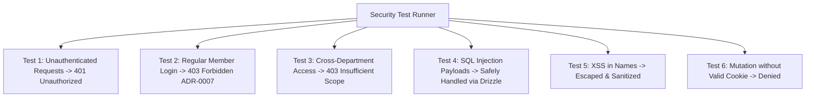

# Testing: Security & Scoped RBAC Validation

## Hitsanat Kifl Children's Ministry Management System
**Document Version:** 2.1  
**Runner:** Vitest + Playwright (`pnpm test:security`)  

---

## 1. Security Test Matrix

---

## 2. Mandatory Negative Test Cases

1. **Non-Leadership Lockout (ADR-0007):**
   - Attempt login with student member holding `role = 'Member'`.
   - Assert: Returns `403 Forbidden` with code `AUTH_NOT_AUTHORIZED_LEADERSHIP`.
2. **Cross-Department Scope Denial (ADR-0005):**
   - Authenticate as `SUB_LEAD_MEZMUR`.
   - Issue `POST /api/v1/timihrt/curriculum`.
   - Assert: Returns `403 Forbidden` with code `FORBIDDEN_INSUFFICIENT_SCOPE`.
3. **Child Data Exfiltration Defense:**
   - Query `/api/v1/public/stats` without credentials.
   - Assert: Response contains only aggregate numbers; zero child phone numbers or residential addresses exposed.
4. **Temporary Permission Grant Expiry (BR-035):**
   - Issue a grant with `expiresAt` in the past or beyond 7 days → assert `400`.
   - Issue a valid grant, then force-expire it and call the bound endpoint → assert `403 FORBIDDEN_INSUFFICIENT_SCOPE`.
5. **Temporary Permission Grant Revocation (BR-035):**
   - As SUPER_ADMIN, create a grant, call `POST /api/v1/permission-grants/:id/revoke`, then call the bound endpoint as the grantee → assert `403`.
   - Double revoke → assert `409`.
6. **Grant Issuance Privilege (BR-035):**
   - As `CHAIRPERSON` (or any non-SUPER_ADMIN), `POST /api/v1/permission-grants` → assert `403`.
