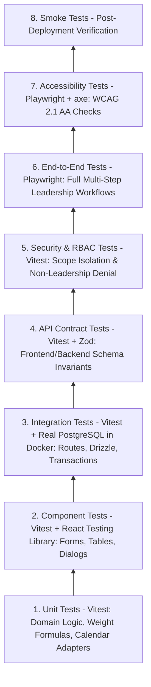

# Testing Strategy & Quality Gates

## Hitsanat Kifl Children's Ministry Management System
**Document Version:** 2.1  
**Architecture ADR:** Layered Testing Strategy (ADR-0010)  

---

## 1. Layered Testing Pyramid

---

## 2. Testing Frameworks & Coverage Standards

| Test Layer | Test Runner / Tooling | Target Environment | Coverage Target |
| :--- | :--- | :--- | :---: |
| **Unit Tests** | Vitest | In-Memory (Node.js) | $> 90\%$ on Domain / Calculation Engines |
| **Component Tests** | Vitest + React Testing Library | jsdom | $> 80\%$ on shared UI components |
| **Integration Tests** | Vitest + Supertest | Disposable PostgreSQL Docker Container | All API Endpoints & DB Constraints |
| **Contract Tests** | Vitest + Zod | In-Memory | All shared API Schemas |
| **Security / RBAC** | Vitest | Real PostgreSQL Test DB | 100% of Scoped Route Guards |
| **End-to-End** | Playwright | Headless Chromium / Firefox / WebKit | Critical Leadership Journeys |
| **Accessibility** | `@axe-core/playwright` | Headless Chromium | 0 Critical or Serious a11y violations |

---

## 3. Real Database Testing Rule (ADR-0010)
**Database Mocking Prohibited for Integration Tests:** Integration tests must never mock PostgreSQL or Drizzle queries. They must execute against a real disposable PostgreSQL instance in Docker to validate foreign keys, composite unique constraints, check constraints, and atomic transactions.
