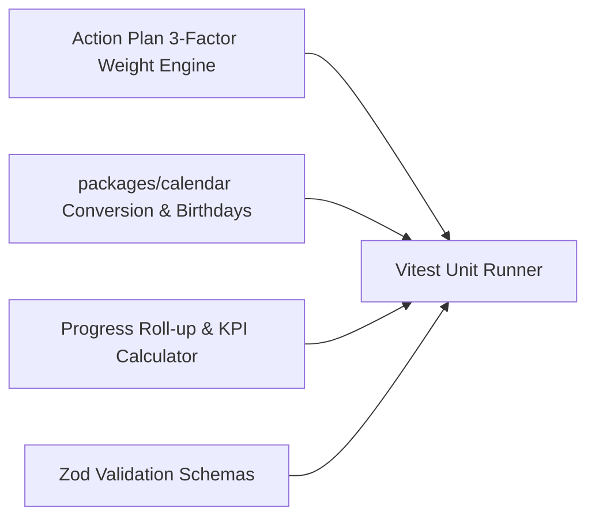

# Testing: Unit & Domain Tests

## Hitsanat Kifl Children's Ministry Management System
**Document Version:** 2.1  
**Runner:** Vitest (`pnpm test:unit`)  

---

## 1. Unit Testing Scope

Unit tests focus on fast, isolated verification of pure TypeScript logic with zero external IO dependencies:

---

## 2. Key Unit Test Suites

### 2.1 Planning Weight Calculation Suite (`packages/domain/test/planning-weight.spec.ts`)
- Verifies exact weight calculation matching `Action PLN.xlsx` formula.
- Verifies that sum of weights for all 25 activities equals exactly `100.0%`.
- Edge cases: zero budget, zero time, division by zero guards.

### 2.2 Ethiopian Calendar Suite (`packages/calendar/test/calendar.spec.ts`)
- Verifies leap year handling (Pagume 5 vs 6 days).
- Verifies bidirectional Gregorian-to-Ethiopian conversion.
- Verifies monthly birthday filter algorithm for the 15th of each month.

### 2.3 Bottom-Up Progress Aggregation Suite (`packages/domain/test/progress-rollup.spec.ts`)
- Verifies weekly tasks rolling up to monthly and quarterly milestones.
- Verifies capped progress percentage ($\le 100.0\%$).
